# P1_Probstat_C_5025201222
Florentino Benedictus<br>5025201222<br>Probabilitas dan Statistik C<br>Praktikum 1
## Soal No. 1
Seorang  penyurvei  secara  acak  memilih  orang- orang  di  jalan  sampai  dia  bertemu  dengan seseorang yang menghadiri acara vaksinasi sebelumnya. 
### 1A.
 Berapa  peluang  penyurvei  bertemu  x  =  3  orang  yang  tidak  menghadiri  acara  vaksinasi
 sebelum  keberhasilan  pertama  ketika  p  =  0,20  dari  populasi  menghadiri  acara  vaksinasi  ?
 (distribusi Geometrik) <br>
 ```r
 #1A
soal_1a<-function(x, p){
  cat("1A. Peluang penyurvei bertemu", x,"orang yang tidak menghadiri vaksinasi
    sebelum keberhasilan pertama sebesar", dgeom(x, p),"\n")
}
soal_1a(3, 0.2)
 ```
 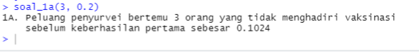
### 1B.
mean  Distribusi  Geometrik  dengan  10000  data  random  ,  prob  =  0,20  dimana  distribusi
 geometrik acak tersebut X = 3 ( distribusi geometrik acak () == 3 ) <br>
```r
#1B
soal_1b<-function(rnd,p,x){
  cat("1B. Mean distribusi geometrik:", mean(rgeom(rnd,p)==x),"\n")
}
soal_1b(10000,0.2,3)
```
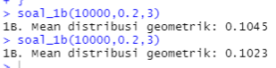
### 1C.
Bandingkan Hasil poin a dan b , apa kesimpulan yang bisa didapatkan?<br>
#### Jawaban 1C:
Nilai hasil 1A dan 1B tidak jauh berbeda meskipun nilai 1B sedikit berubah-ubah akibat adanya faktor random
### 1D.
Histogram Distribusi Geometrik , Peluang X = 3 gagal Sebelum Sukses Pertama<br>
```r
soal_1d<-function(x, p, num_x){
  vector_iter<-0:num_x
  vector_ans<-c()
  for(i in -1:num_x)vector_ans[i+1]=dgeom(i, p)
  my_colors<-c()
  for(i in 0:num_x){
    if(i==x+1)my_colors[i]="Red"
    else my_colors[i]="Black"
  }
  plot(vector_iter,vector_ans,type='h',main='Distribusi Geometrik'
       ,ylab="Peluang",xlab="X = ...",col=my_colors, lwd=3)
}
soal_1d(3, 0.2, 20)
```
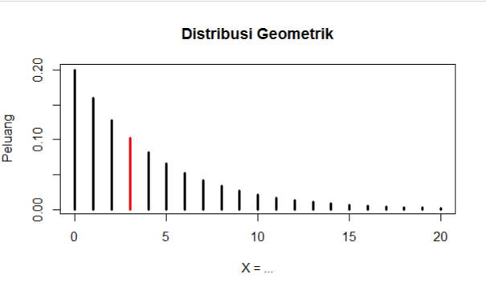<br>
Pada soal ini nilai `x` yang diinginkan akan berwarna merah pada grafik dengan menggunakan vector colors, jumlah X maksimum yang ingin ditampilkan mulai dari 0 dapat diganti dengan mengubah nilai `num_x`
### 1E.
Nilai Rataan (μ) dan Varian (σ²) dari Distribusi Geometrik.<br>
```r
#1E
soal_1e<-function(p){
  q=1-p
  rataan=1/p
  varian=q/p^2
  cat("1E. Rataan adalah:", rataan,",dan varian adalah:", varian,"\n")
}
soal_1e(0.2)
```
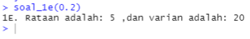<br>

## Soal No. 2
Terdapat 20 pasien menderita Covid19 dengan peluang sembuh sebesar 0.2. Tentukan :<br>
### 2A.
Peluang terdapat 4 pasien yang sembuh.<br>
```r
#No. 2
#2A
soal_2a<-function(x, n, p){
  cat("2A. Peluang terdapat",x,"pasien sembuh sebesar",dbinom(x, n, p),"\n")
}
soal_2a(4, 20, 0.2)
```
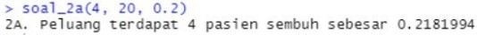<br>
### 2B.
Gambarkan grafik histogram berdasarkan kasus tersebut.<br>
```r
#2B
soal_2b<-function(n, p){
  success <- 0:n
  plot(success, dbinom(success, n, p),type='h',main="2B. Distribusi Binomial",
       ylab="Peluang",xlab="Jumlah Sembuh",lwd=5)
}
soal_2b(20, 0.2)
```
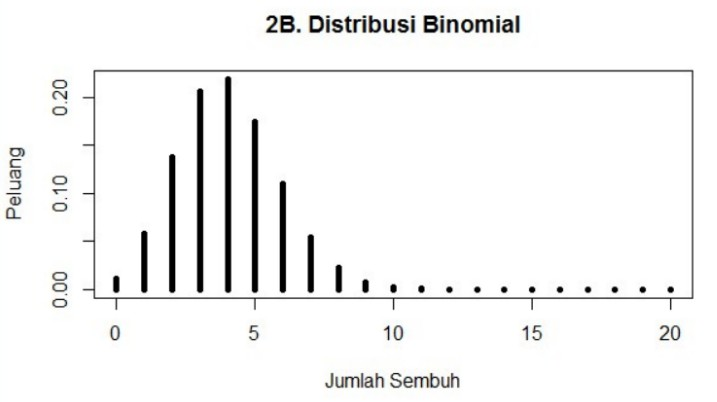<br>
### 2C.
Nilai Rataan (μ) dan Varian (σ²) dari Distribusi  Binomial.<br>
```r
#2C
soal_2c<-function(n, p){
  rataan=n*p
  q=1-p
  varian=n*p*q
  cat("2C. Rataan adalah:", rataan,",dan varian adalah:", varian,"\n")
}
soal_2c(20, 0.2)
```
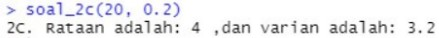<br>

## Soal No. 3
Diketahui data dari  sebuah tempat bersalin di rumah sakit tertentu menunjukkan rata- rata historis
 4,5 bayi lahir di rumah sakit ini setiap hari. (gunakan Distribusi Poisson) <br>
### 3A.
Berapa peluang bahwa 6 bayi akan lahir di rumah sakit ini besok?<br>
```r
#3A
soal_3a<-function(x, lambd){
  p = dpois(x, lambd)
  cat("3A. Peluang",x,"bayi lahir di rumah sakit besok adalah",p,"\n")
}
soal_3a(6, 4.5)
```
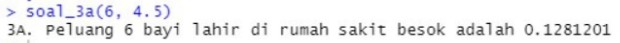<br>
### 3B.
simulasikan dan buatlah histogram kelahiran 6 bayi akan lahir di rumah sakit ini  selama 
 setahun (n = 365)<br>
```r
#3B
soal_3b<-function(x, lambd){
  vector_year<-c()
  for(i in 1:365)vector_year[i]<-i
  vector_pois<-c()
  for(i in 1:365)vector_pois[i]<-dpois(x,lambd)
  plot(vector_year,vector_pois,type='h',main="3B. Distribusi Poisson",
       ylab="Peluang",xlab="Hari",lwd=1)
}
soal_3b(6, 4.5)
```
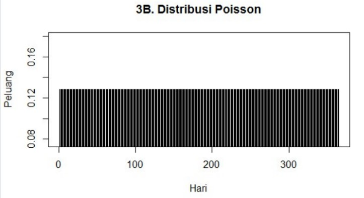<br>
### 3C.
dan bandingkan hasil poin a dan b , Apa kesimpulan yang bisa didapatkan<br>
#### Jawaban 3C:
Nilai peluang dengan distribusi poisson hanya bergantung pada nilai x dan mean sehingga tidak bergantung waktu dan peluang dalam satu tahun akan bernilai sama
### 3D.
Nilai Rataan (μ) dan Varian (σ²) dari Distribusi  Poisson.<br>
```r
#3D
soal_3d<-function(lambd){
  rataan=lambd
  varian=lambd
  cat("3D. Rataan:",rataan,", dan varian:",varian,"\n")
}
soal_3d(4.5)
```
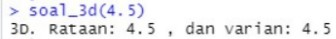<br>

## Soal No. 4
Diketahui nilai x = 2 dan v = 10. Tentukan:<br>
### 4A.
Fungsi Probabilitas dari Distribusi Chi- Square.<br>
```r
#No. 4
#4A
soal_4a<-function(x, v){
  dchisq(x,v)
}
soal_4a(2, 10)
```
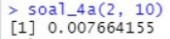<br>
### 4B.
Histogram dari Distribusi Chi- Square dengan 100 data random.<br>
```r
#4B
soal_4b<-function(rd){
  res_rchisq <- rchisq(rd, df = 10)
  hist(res_rchisq,main="4B. Histogram Chi-Square 100 data random")
}
soal_4b(100)
```
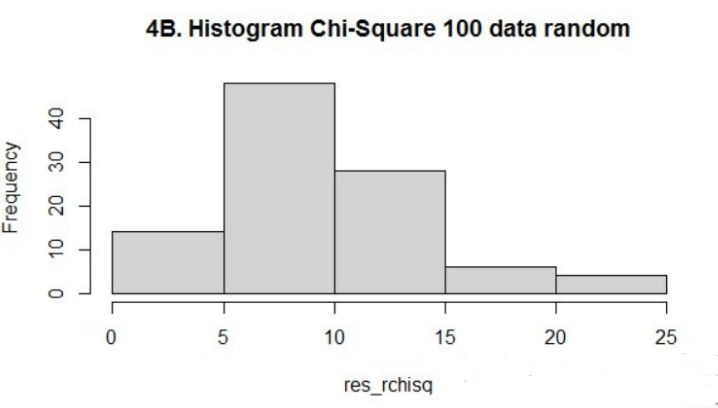<br>
### 4C.
Nilai Rataan (μ) dan Varian (σ²) dari Distribusi  Chi- Square.<br>
```r
#4C
soal_4c<-function(v){
  rataan=v
  varian=2*v
  cat("4C. Rataan adalah:", rataan,",dan varian adalah:", varian,"\n")
}
soal_4c(10)
```
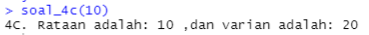<br>
 
## Soal No. 5
Diketahui bilangan acak  (random v ariable)  berdistribusi  exponential (λ = 3). Tentukan<br>
Petunjuk: <br>
 ●  Gunakan set.seed(1)<br>
 ●  Gunakan fungsi bawaan R <br>
### 5A.
Fungsi Probabilitas dari Distribusi Exponensial<br>
### 5B.
Histogram dari Distribusi Exponensial untuk 10, 100, 1000 dan 10000 bilangan random <br>
### 5C.
Nilai Rataan (μ) dan Varian (σ²) dari Distribusi  Exponensial untuk n = 100 dan λ = 3<br>

## Soal No. 6
Diketahui generate random nilai sebanyak 100 data, mean = 50, sd = 8. Tentukan<br>
### 6A.
Fungsi Probabilitas dari Distribusi Normal P(X1 ≤ x ≤ X2), hitung Z- Score Nya dan plot 
 data generate randomnya dalam bentuk grafik. Petunjuk(gunakan fungsi plot()).<br>
 Keterangan :<br>
 X1 = Dibawah rata- rata<br>
 X2 = Diatas rata- rata<br>
 Contoh data : <br>
  1,2,4,2,6,3,10,11,5,3,6,8<br>
 rata- rata = 5.083333<br>
 X1 = 5<br>
 X2 = 6 <br>
### 6B.
Generate Histogram dari Distribusi Normal dengan breaks 50 dan format penamaan:<br>
 NRP_Nama_Probstat_{Nama Ke las}_DNhistogram<br>
 Contoh :<br>
 312312312_Rola_Probstat_A_DNhistogram <br>
### 6C.
Nilai Varian (σ²) dari hasil generate random nilai  Distribusi Normal.<br>
